# 📚 Serverless Student Management API on AWS

A production-style **serverless Student Management API** built using **AWS Lambda**, **Amazon API Gateway (HTTP API)**, **Amazon RDS MySQL**, **AWS Secrets Manager**, **Amazon VPC**, and a **Lambda Layer (PyMySQL)**.

The application demonstrates how to build a secure serverless backend that performs **Create, Read, Update, and Delete (CRUD)** operations on student records stored in a MySQL database running on Amazon RDS.

---

## 📑 Table of Contents

- [🚀 Project Overview](#-project-overview)
- [🏗️ Architecture](#️-architecture)
- [☁️ AWS Services Used](#️-aws-services-used)
- [✨ Features](#-features)
- [🔄 Project Workflow](#-project-workflow)
- [📸 Screenshots](#-screenshots)
- [🔌 API Endpoints](#-api-endpoints)
- [🧪 Sample Request](#-sample-request)
- [🔐 Security](#-security)
- [📁 Repository Structure](#-repository-structure)
- [🛠️ Technologies Used](#️-technologies-used)
- [🎯 Learning Outcomes](#-learning-outcomes)
- [👨‍💻 Author](#-author)

---

## 🚀 Project Overview

This project exposes RESTful-style HTTP endpoints using Amazon API Gateway (HTTP API). Incoming requests invoke an AWS Lambda function that securely retrieves database credentials from AWS Secrets Manager through a VPC Interface Endpoint and performs CRUD operations on an Amazon RDS MySQL database running inside private subnets.

The solution demonstrates AWS best practices by:

- Using private subnets for the database
- Keeping database credentials in AWS Secrets Manager
- Running Lambda inside a VPC
- Connecting to Secrets Manager through a VPC Interface Endpoint
- Using a Lambda Layer for the PyMySQL dependency
- Logging execution details with Amazon CloudWatch

---

## 🏗️ Architecture

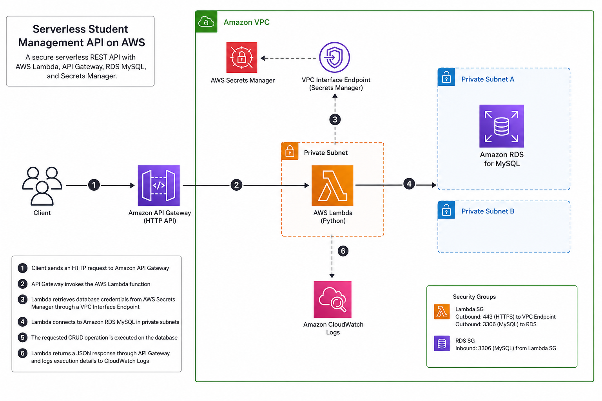

The architecture follows a serverless design where API Gateway receives HTTP requests and invokes an AWS Lambda function. Lambda securely retrieves database credentials from AWS Secrets Manager through a VPC Interface Endpoint before connecting to an Amazon RDS MySQL database hosted in private subnets. Execution logs are captured in Amazon CloudWatch for monitoring and troubleshooting.

---

## ☁️ AWS Services Used

- Amazon API Gateway (HTTP API)
- AWS Lambda
- Amazon RDS for MySQL
- AWS Secrets Manager
- Amazon VPC
- Private Subnets
- Security Groups
- VPC Interface Endpoint (Secrets Manager)
- Lambda Layer (PyMySQL)
- Amazon CloudWatch Logs
- IAM Roles & Policies

---

## ✨ Features

- Create a student
- Retrieve all students
- Retrieve a student by ID
- Update student information
- Delete a student
- Secure database credential management
- Serverless architecture
- Fully deployed and tested on AWS

---

## 🔄 Project Workflow

1. A client sends an HTTP request to Amazon API Gateway.
2. API Gateway invokes the AWS Lambda function.
3. Lambda securely retrieves the database credentials from AWS Secrets Manager through a VPC Interface Endpoint.
4. Lambda connects to the Amazon RDS MySQL database running in private subnets.
5. The requested CRUD operation is executed.
6. Lambda returns a JSON response through API Gateway back to the client.

---

## 📸 Screenshots

### 1. AWS Lambda Function

Lambda function overview.

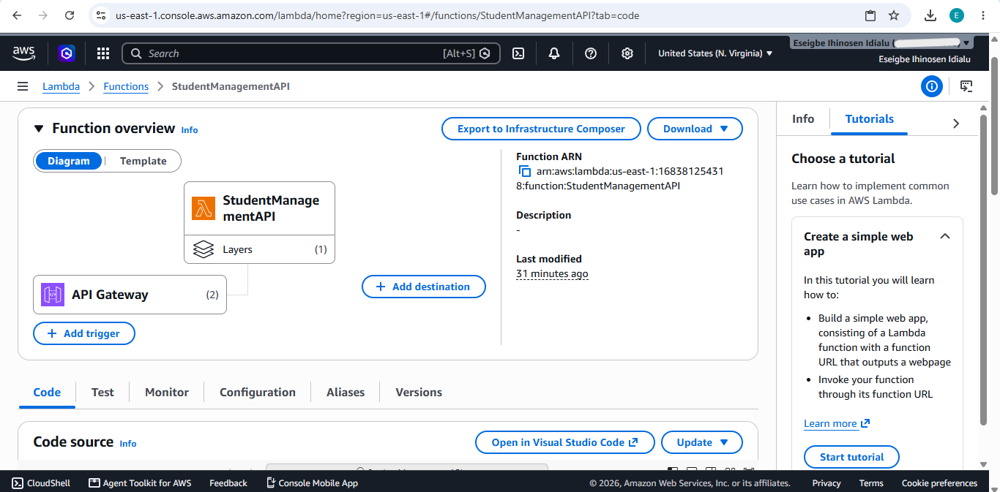

---

### 2. Lambda Layer

PyMySQL Lambda Layer.

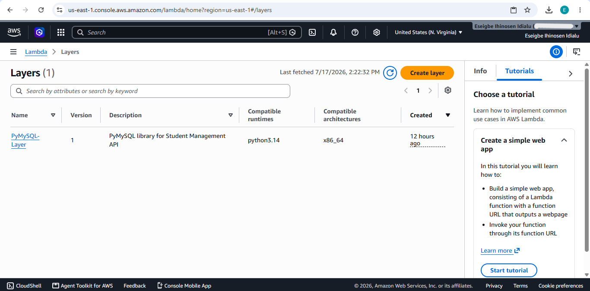

---

### 3. Lambda VPC Configuration

Lambda configured inside private subnets.

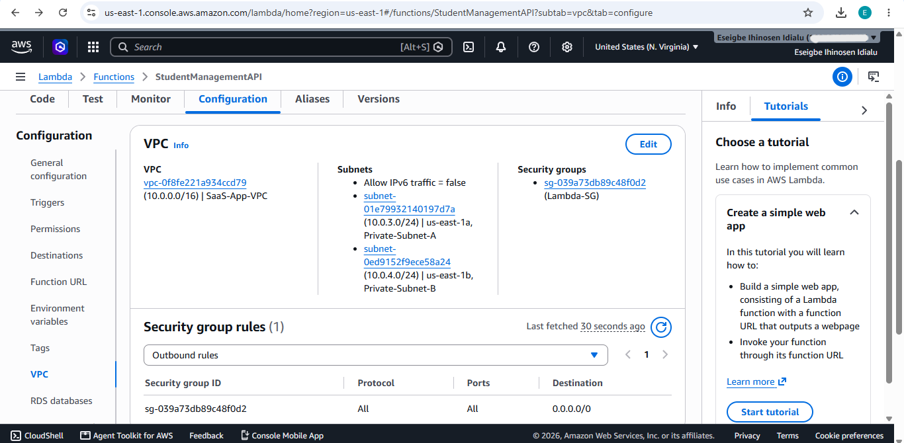

---

### 4. API Gateway HTTP API

HTTP API configuration.

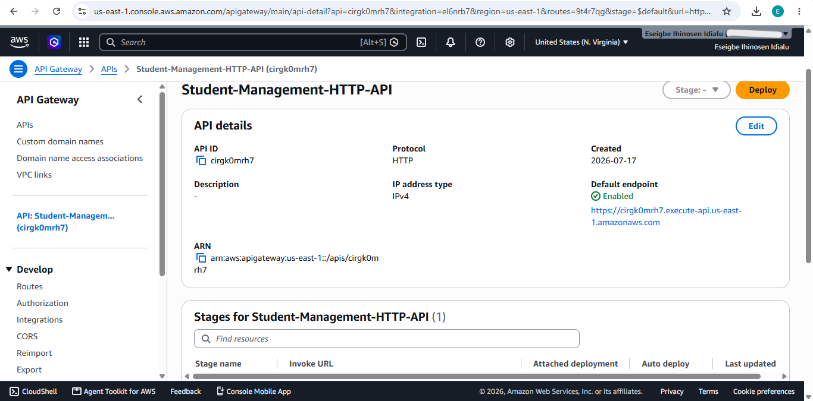

---

### 5. API Routes

Configured routes.

- `ANY /students`
- `ANY /students/{student_id}`

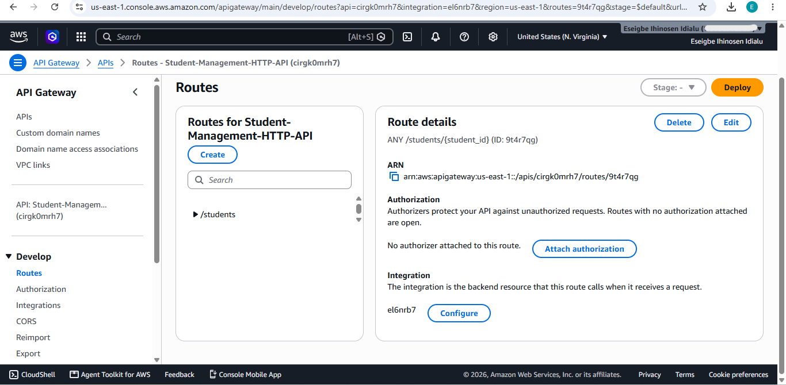

---

### 6. AWS Secrets Manager

Database credentials stored securely.

> **Note:** Secret values are hidden.

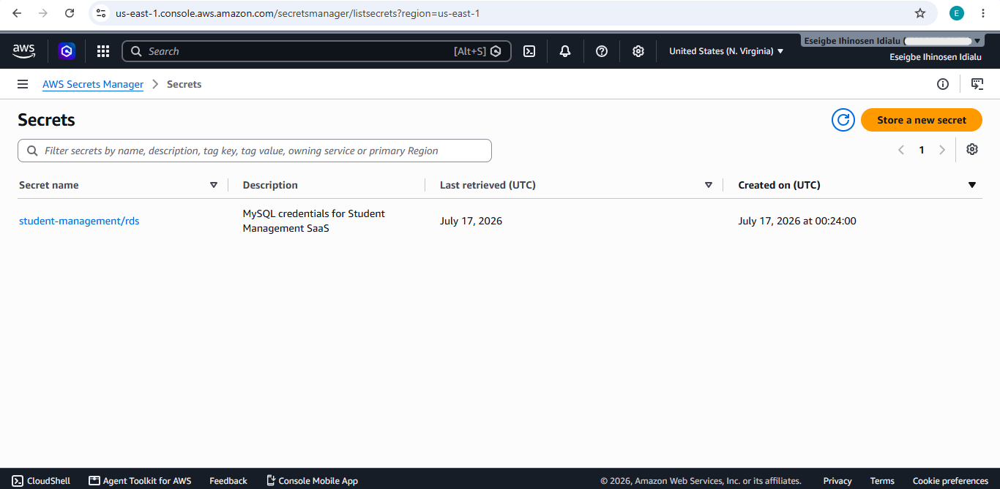

---

### 7. Amazon RDS

Amazon RDS MySQL instance.

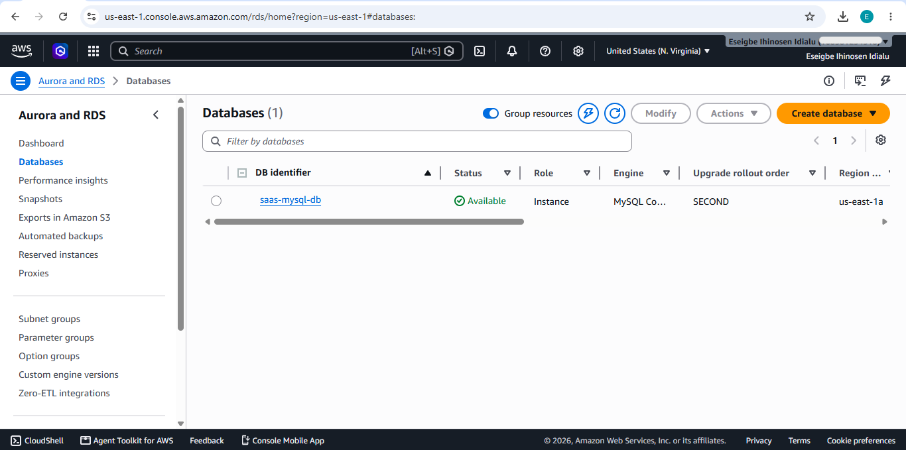

---

### 8. Database Tables

#### Students Table

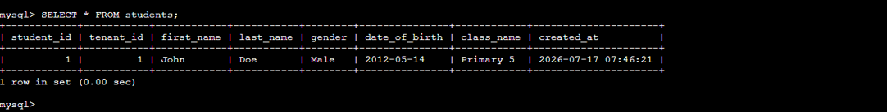

#### Tenants Table

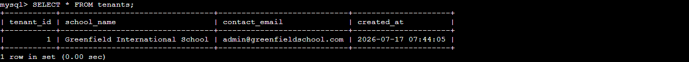

---

### 9. Browser Test

Testing the GET endpoint from a web browser.

**GET**

```text
/students
```

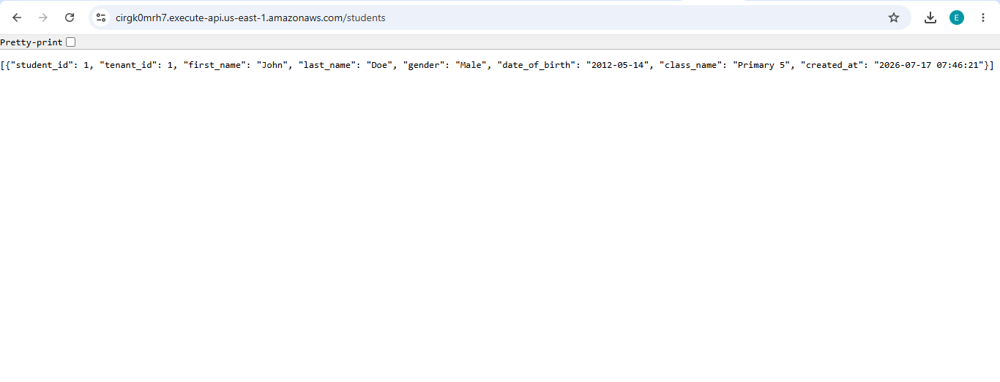

---

### 10. POST Request

Create a new student.

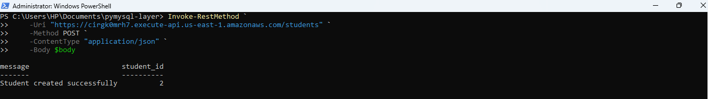

---

### 11. PUT Request

Update an existing student.

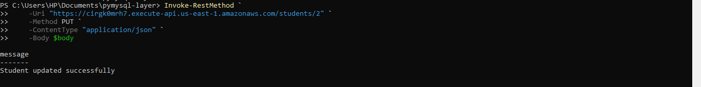

---

### 12. DELETE Request

Delete a student.

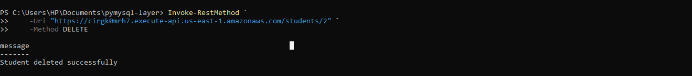

---

### 13. CloudWatch Logs

Successful Lambda execution logs.

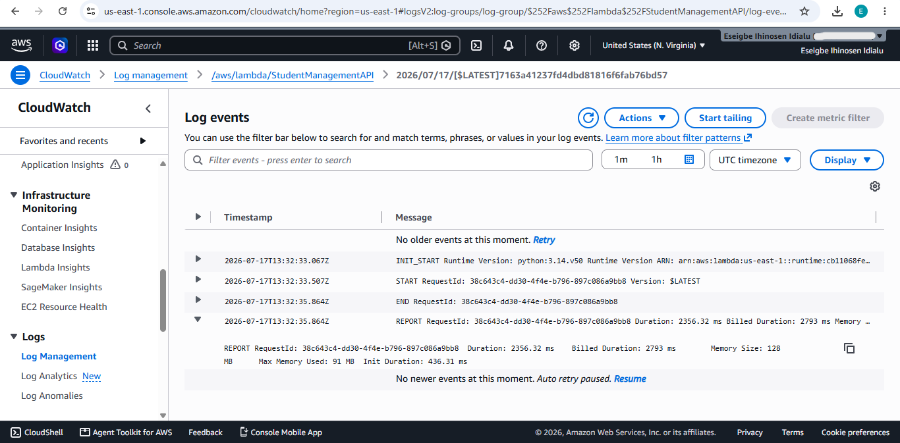

---

## 🔌 API Endpoints

| Method | Endpoint | Description |
|---------|----------|-------------|
| GET | `/students` | Retrieve all students |
| GET | `/students/{student_id}` | Retrieve a student by ID |
| POST | `/students` | Create a student |
| PUT | `/students/{student_id}` | Update a student |
| DELETE | `/students/{student_id}` | Delete a student |

---

## 🧪 Sample Request

### POST /students

```json
{
  "tenant_id": 1,
  "first_name": "Jane",
  "last_name": "Smith",
  "gender": "Female",
  "date_of_birth": "2013-08-22",
  "class_name": "Primary 4"
}
```

---

## 🔐 Security

- Database credentials stored securely in AWS Secrets Manager
- Lambda runs inside a private Amazon VPC
- Amazon RDS deployed in private subnets
- Least-privilege IAM permissions
- Secrets Manager accessed through a VPC Interface Endpoint
- No credentials stored in source code

---

## 📁 Repository Structure

```text
.
├── LICENSE
├── README.md
├── lambda_function.py
└── screenshots
    ├── architecture-diagram.png
    ├── lambda-function.png
    ├── lambda-layer.png
    ├── lambda-vpc.png
    ├── api-gateway-http-api.png
    ├── api-routes.png
    ├── secrets-manager.png
    ├── rds-instance.png
    ├── students-table.png
    ├── tenants-table.png
    ├── browser-test.png
    ├── post-student.png
    ├── update-student.png
    ├── delete-student.png
    └── cloudwatch-logs.png
```

---

## 🛠️ Technologies Used

### Programming Language
- Python

### Cloud Services
- AWS Lambda
- Amazon API Gateway (HTTP API)
- Amazon RDS MySQL
- AWS Secrets Manager
- Amazon VPC
- Amazon CloudWatch

### Database
- MySQL

### Networking
- Private Subnets
- Security Groups
- VPC Interface Endpoint

### IAM & Security
- IAM Roles & Policies

### Dependency Management
- Lambda Layer (PyMySQL)

---

## 🎯 Learning Outcomes

This project demonstrates:

- Building a serverless backend using AWS
- Connecting AWS Lambda to an Amazon RDS MySQL database inside a private Amazon VPC
- Managing secrets securely with AWS Secrets Manager
- Creating CRUD endpoints with API Gateway HTTP API
- Using Lambda Layers for third-party Python packages
- Monitoring Lambda with CloudWatch
- Troubleshooting IAM, networking, and VPC connectivity

---

## 👨‍💻 Author

**Eseigbe Ihinosen**

Aspiring Cloud & Cybersecurity Engineer

GitHub: <https://github.com/eseigbeihinosen>